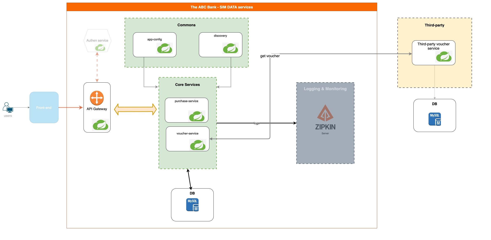
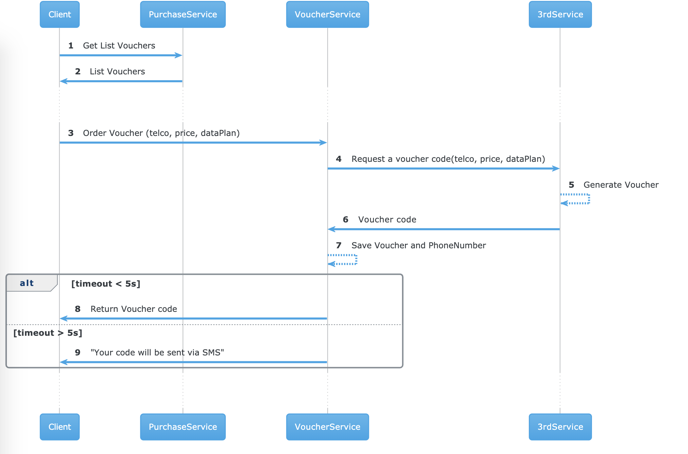
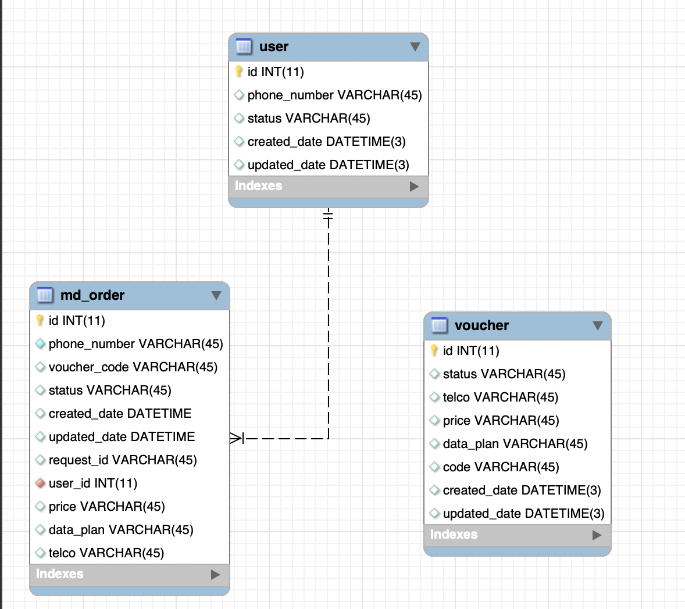

## Requirements
Bank ABC want to provide a new feature on its website is to purchase prepaid data for a SIM card by getting a voucher code from a 3rd party.

### Tech stack
- Java 8
- Spring Boot 2.4
- Spring Cloud
- Log4j
- JUnit 4
- MySQL
- Docker

### Features:
-  API Gateway takes all API calls from clients, then routes them to the appropriate microservice.
-  Dynamic config provide centralized configuration management for microservices
-  Service discovery allow service to locate backing services in a consistent way regardless of where the application is deployed.
-  Log/request tracing with X-request-id
-  Phone number encryption to prevent data leaking
-  Response pagination
-  Swagger API documentation

## Project details
### High-level architecture


- **Purchase service**: Managing purchased vouchers
- **Voucher service**: Provide integration between bank ABC and 3rd service
- **3rd service**: Acting as external service to provide prepaid data for a SIM card using vouchers
- **Authen service**: User authentication and access control (Not implemented yet)
- **Logging & monitoring service**: Distributed loging and monitoring (Not implemented yet)

### Inter service communication flow




### ERD




# Deploy stack by docker-compose

## Requirements: 
       - OS: 
       + MacOS/Windows: Docker Desktop
       -> https://www.docker.com/products/docker-desktop

       + Linux: Docker comnpose
       -> https://docs.docker.com/compose/install/

## Build
- cd to docker-compose.yml level and type: `docker-compose build --parallel` for building docker inmages.
- Notes: If there are any change in code we need to re-build the docker compose.
## Deploy:
- To run stack , type: `docker-compose up -d` then wait 1-2 minutes to ensure all service fully started.
- Notes: -d option for detach mode, docker compose will run in background.
- To verify status, type: `docker-compose ps`
```
       ➜  mobile-data: docker-compose ps    
                     Name                             Command               State   Ports
       ----------------------------------------------------------------------------------
       mobile-data_app-config_1            java -Djava.security.egd=f ...   Up           
       mobile-data_db_1                    docker-entrypoint.sh mysqld      Up           
       mobile-data_discovery_1             java -jar /src/app.jar           Up           
       mobile-data_gateway_1               java -Djava.security.egd=f ...   Up           
       mobile-data_purchase-service_1      java -Djava.security.egd=f ...   Up           
       mobile-data_third-party-service_1   java -Djava.security.egd=f ...   Up           
       mobile-data_voucher-service_1       java -Djava.security.egd=f ...   Up 
```
## Deploy new version:
- To deploy new version we need to `Buid` then `Deploy` again.

## URLs:
- Swagger: http://localhost:8080/voucher/swagger-ui.html
  
- Purchase a voucher: 
    `curl -X POST "http://localhost:8080/voucher/api/v1/voucher" -H "Accept: */*" -H "X-Request-Id: 123456" -H "Content-Type: application/json" -d "{ \"dataPlan\": \"5G\", \"phoneNumber\": \"0912345678\", \"price\": \"500\", \"telco\": \"Viettel\"}"`
- List all voucher by phone number: 
    `curl -X GET "http://localhost:8080/voucher/api/v1/vouchers?phoneNumber=0912345678" -H "accept: */*" -H "X-Request-Id: 12345"`
- List available products: 
    `curl -X GET "http://localhost:8080/purchase/api/v1/products" -H "Accept: application/json"  -H "X-Request-Id: 11111"`


